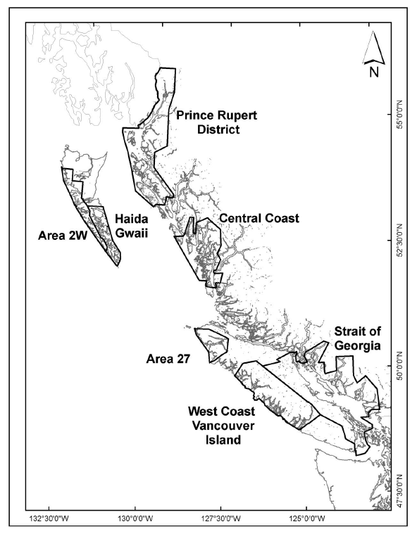

```{r setup, include=FALSE}
knitr::opts_chunk$set(echo = FALSE, warning = FALSE, message = FALSE)
options(knitr.kable.NA = '')
library(knitr)
library(tidyverse)
library(hrbrthemes)
library(bookdown)
library(plotly)
source("./R/cpi_function.R")
cpi <- read_csv("./Data/Canadian_CPI.csv") %>% 
  mutate(base_year=2002) %>% 
  select(-InflationRate)
cpi_2015 <- inflation_adjust(cpi, 2015) %>% 
  rename(Year=year)
#theme_set(theme_ipsum()) # Doesn't work on PC because it's missing Arial Narrow font.
theme_set(theme_ipsum_rc())

number_call <- function(num, decimals){
  x <- prettyNum(num, big.mark = ",", small.mark = ".", digits=decimals) 
  return(x)
}

#ipsum(number_sections = TRUE)
# bookdown::gitbook: 
#     self_contained: true
#     split_by: "none"
#     download: ["pdf"]

```

Prepared for Pacific Wild


```{r}
#Notes:
#Add in total salmon line in SoG and then the SoG share of the roe herring fishery from expected use/catch tables. 
#Fix stacked bar graph labels so they are readable. Also potentially need to summarize data before turning into graph to get rid of grey lines between species within the groups.
#Update bibliography and check references
#Label code chunks and work on printing figure captions along in report.
#Work on price and value added graphs as right now they don't say much
#Do I want to go with the ipsum colour palette?


#Sections without a lot of data:
#By-products from Processing!
#What would a moratorium look like? Perhaps quite cheap right now as its value has been eroded.

```


# Executive Summary


## Terms & Notes
Ex-vessel value - the value of fish or seafood at its first point of sale (i.e., the price the fishers receive)
Unless otherwise stated, all values are expressed in real 2015 dollars to account for inflation over the time period studied. 
Tonnes refers to metric tonnes (1000 kilograms, 1kg = 2.2 lbs). Some reports use short tons (2000 lbs) and this was converted to metric tonnes when necessary. 

# Introduction

This report was prepared for Pacific Wild to evaluate the current value of the herring roe fishery in the Strait of Georgia in British Columbia. The herring roe fishery has a long history in BC and is a valuable part of BC's seafood exports. This fishery makes up the largest component of the Pacific herring fisheries in BC, and is the most valuable aspect of the fishery. The herring fishery in BC is composed of several segments: roe herring undertaken with purse seine or gillnets, food and bait herring, herring spawn on kelp, and special use herring. Each of these has their own (or several) licences within the category that allow fishers to fish for this purpose. This report focuses specifically on the seine and gillnet roe fishery, while including the food and bait fishery and spawn on kelp fisheries when important for context. We also focus on one key fishing ground for the roe fishery, the Strait of Georgia (Figure \@ref(fig:map)), where the fishery has been especially concentrated in recent years. 


General description of the fishery + focus of this report


```{r map, echo=FALSE, fig.cap="Figure 1. Map of roe herring fishing areas in British Columbia. Source: Fisheries and Oceans Canada, 2018.", out.width = '50%'}
#Probably need a map of the area here. 

```

The most important area for the roe herring fishery is the Strait of Georgia (SoG) (Figure \@ref(fig:catches-area)). For the upcoming herring season, there are no catches in the roe herring fisheries expteced outside of the Strait.  

```{r catches-area, echo=F, warning=F, message=F, fig.cap="Roe herring catches by major fishing area"}
# catch_area <- read_csv("./Data/HerringCatchAreaExpectedUse.csv")
catch_area <- read_csv("./Data/herring_season_summaries.csv")

catch_area <- catch_area %>% 
  filter(Measure=="Landings") %>% 
  filter(Fishery=="Roe herring")

catch_area$Value[which(catch_area$Value=="0*")] <- 0 
catch_area$Value[which(catch_area$Value=="-")] <- 0 
catch_area$Value <- gsub(catch_area$Value, pattern=",", replacement="")
catch_area$Value <- as.numeric(catch_area$Value)
catch_area$Amount <- catch_area$Value* 2000 /2204.623 #Convert short tons to tonnes 


#Clean up names
df <- data.frame(Area=c("StraitofGeorgia", 
                        "PrinceRupertDistrict",
                        "CentralCoast",
                        "WestCoastVancouverIsland",
                        "HaidaGwaii"), 
                 AREA=c("SOG",
                        "PR",
                        "CC",
                        "WCVI",
                        "HG"))
catch_area <- catch_area %>% left_join(df)

catch_area <- catch_area %>%
  mutate(Area=as.factor(AREA)) %>% 
  group_by(Year, Area) %>% 
  summarize(Amount = sum(Amount))

catch_area_total <- catch_area %>%
  group_by(Year) %>% 
  summarize(Amount = sum(Amount)) %>% 
  mutate(Area = "Total")
catch_area <- catch_area %>% bind_rows(catch_area_total)

catch_area$Area <- fct_relevel(catch_area$Area, "Total", after=5)
catch_area_perc <- catch_area %>% 
  filter(Area != "Total") %>% 
  group_by(Year) %>%
  mutate(perc = 100*Amount/sum(Amount))

start_year <- 1983
mid_year <- 2001
end_year <- 2018


start_year_value <- catch_area_perc %>% 
  filter(Year == start_year) %>% 
  filter(Area=="SOG") %>% 
  pull(Amount)
end_year_value <- catch_area_perc %>% 
  filter(Year == end_year) %>% 
  filter(Area=="SOG") %>% 
  pull(Amount) 

start_year_perc_value <- catch_area_perc %>% 
  filter(Year == start_year) %>% 
  filter(Area=="SOG") %>% 
  pull(perc) %>% 
  round(1)
end_year_perc_value <- catch_area_perc %>% 
  filter(Year == end_year) %>% 
  filter(Area=="SOG") %>% 
  pull(perc) %>% 
  round(1)


#scales::show_col(ipsum_pal()(5))

catch_area_plot <- catch_area %>% ggplot(aes(x=Year,y=Amount, color=Area)) +
  geom_line() +
  ylab("Amount (tonnes)") + 
  #scale_y_continuous(labels=c(seq(0, 25000, 5000)), expand=c(0,0)) + 
  #scale_x_continuous(labels=c(seq(2001, 2019, 4)), expand=c(0,0)) +
  annotate(geom="text", x=start_year+.75, y= start_year_value+2000, label=paste(start_year_perc_value, "%", sep=""), color="#75b8d1") + 
  annotate(geom="text", x=end_year+.25, y= end_year_value-2000, label=paste(end_year_perc_value, "%", sep=""), color="#75b8d1") +
  scale_color_ipsum() + 
  NULL
plot(catch_area_plot)

```


# Value of the Fisheries
1.	Value of the fisheries: What are the total values (landed value, wholesale value) of the Strait of Georgia herring seine and gill net fisheries? [note: we're specifically interested in the roe-herring fishery, but if the food-bait or SOK fisheries data are the same places, please report that too.]

The SoG has consistently accounted for the majority of the catches of roe herring accounting for two-thirds in the early 2000s, but has now increased to be the only area with an active roe herring fishery with almost all the catch in 2018 and all catches expected for the 2019 season [@DFO2018]. 

Over the past 10 years, the roe herring fishery has fluctuated between an ex-vessel value of 4 and 17 million (Figure \@ref(fig:landed-value)). Formerly the values were much higher exceeding 100 million CAD in 1987. In addition, the wholesale value is substantially higher than the landed value as herring roe is a value added product. 

```{r catch-by-type, echo=F, warning=F, message=F, fig.cap="Catch of herring by fishery type"}
##Plots of catch, landed value, and wholesale values
fisherytype_value <- read_csv("./Data/HerringValueFisheries.csv")
fisherytype_value <- fisherytype_value %>%
  mutate_if(is.character, as.factor) %>%
  filter(Fishery != "Total") %>% 
  left_join(cpi_2015) %>% 
  mutate(Value= if_else(str_detect(Measure, pattern=" value"), Value*adj_value, Value))

fisherytype_value_plot <- fisherytype_value %>%
  filter(Measure=="Landings") %>% 
  ggplot(aes(x=Year,y=Value, color=Fishery)) +
  geom_line() +
  ylab("Landings (thousand tonnes)") + 
  scale_y_continuous(expand=c(0,0)) + 
  scale_x_continuous(labels=c(seq(2001, 2018, 4)), expand=c(0,0)) +
  NULL
plot(fisherytype_value_plot)

```


```{r landed-value, echo=F, warning=F, message=F, fig.cap="Ex-vessel value of herring fisheries"}

fisherytype_landed_value_plot <- fisherytype_value %>%
  filter(Measure=="Landed value") %>% 
  ggplot(aes(x=Year,y=Value, color=Fishery)) +
  geom_line() +
  ylab("Ex-vessel value (Million $)") + 
  scale_y_continuous(expand=c(0,0)) + 
  scale_x_continuous(labels=c(seq(2001, 2018, 4)), expand=c(0,0)) +
  NULL
plot(fisherytype_landed_value_plot)
```


As herring roe is a processed product, it naturally has a higher price than the raw material of whole herring. In addition, the wholesale value includes the value of the fishery derived from the production and sale of fishmeal and fish oil from the herring by-products. 

```{r wholesale-value, echo=F, warning=F, message=F, fig.cap="Wholesale value of herring fisheries"}
fisherytype_end_value_plot <- fisherytype_value %>%
  filter(Measure=="Wholesale value") %>% 
  ggplot(aes(x=Year,y=Value, color=Fishery)) +
  geom_line() +
  ylab("Wholesale value (Million $)") + 
  scale_y_continuous(expand=c(0,0)) + 
  scale_x_continuous(labels=c(seq(2001, 2018, 4)), expand=c(0,0)) +
  NULL
plot(fisherytype_end_value_plot)
```


```{r season-summaries, echo=F, warning=F, message=F, fig.cap="Roe herring landings by gear and  area"}
season_summary <- read_csv("./Data/herring_season_summaries.csv")

fisheries <- c("Roe herring", "Food and Bait")
fisheries <- c("Roe herring") #Exlcuding food and bait for now. 

catch_measures <- c("Quota Issued", "Landings")

season_summary <- season_summary %>%
  filter(Fishery %in% fisheries) %>% 
  filter(Measure %in% catch_measures)

season_summary$Value <- gsub(season_summary$Value, pattern="0\\*", replacement="0")
season_summary$Value <- gsub(season_summary$Value, pattern="-", replacement="0")
season_summary$Value <- gsub(season_summary$Value, pattern=",", replacement="")
season_summary$Value <- gsub(season_summary$Value, pattern="\\*N/A", replacement="")
season_summary$Value <- as.numeric(season_summary$Value)
season_summary$Value <- season_summary$Value * 2000 /2204.623 #Convert from short tons to tonnes

season_summary$Fishery[is.na(season_summary$Gear)==F] <- paste(season_summary$Gear[is.na(season_summary$Gear)==F], season_summary$Fishery[is.na(season_summary$Gear)==F], sep= " ")

#season_summary_spread <- spread(season_summary, key=Measure, value=Value)

season_summary_plot <- season_summary %>% ggplot(aes(x=Year,y=Value, color=Area)) +
  geom_line() +
  ylab("Amount (tonnes)") + 
  scale_y_continuous(expand=c(0,0)) + 
  #scale_x_continuous(labels=c(seq(1980, 2018, 4)), expand=c(0,0)) +
  facet_wrap(~Fishery, scales = "free", ncol=1) + 
  NULL
plot(season_summary_plot)

# season_summary_plot <- season_summary_spread %>% ggplot(aes(x=Year,y=Landings, group=Fishery, color=Fishery)) +
#   geom_line() +
#   geom_line(aes(y=season_summary_spread$`Quota Issued`, group=Fishery, alpha=0.3)) + 
#   ylab("Amount (tonnes)") + 
#   scale_y_continuous(expand=c(0,0)) + 
#   #scale_x_continuous(labels=c(seq(2010, 2018, 4)), expand=c(0,0)) +
#   facet_wrap(~Area, scales = "free_y") + 
#   NULL
# plot(season_summary_plot)

```


The decline in total value of the fishery is both a function of a decline in landings, and a decline in ex-vessel prices recevived by fishers. 
There is some indication, however, that the prices reported by fishers does not necessarily indicate lower profitability as processors have been more willing to pay fishers fees thus lowering their cost of fishing [@SeafoodProducersAssociationofBC2015a]. 

```{r ex-vessel-price, echo=F, warning=F, message=F, fig.cap="Ex-vessel price by fishery"}
fisherytype_value <- read_csv("./Data/HerringValueFisheries.csv")
fisherytype_value <- fisherytype_value %>%
  mutate_if(is.character, as.factor) %>%
  filter(Fishery != "Total")
fisherytype_value <- fisherytype_value %>% 
  left_join(cpi_2015) %>% 
  mutate(Value= if_else(str_detect(Measure, pattern=" value"), Value*adj_value, Value)) %>% 
  select(-c(cpi, base_year, adj_value))

  
  
price_factors <- spread(fisherytype_value, value=Value, -Fishery) %>%
  mutate(ExVesselPrice = `Landed value` /Landings, #Units are dollars per kilogram
         AddedValue = ((`Wholesale value`/`Landed value`)-1) * 100)

# price_factor_plot <- price_factors %>%
#   ggplot(aes(x=Year)) +
#   geom_line(aes(y=ExVesselPrice, group=Fishery, color="Ex-vessel Price")) +
#   geom_line(aes(y=AddedValue/13, group=Fishery, color="Value added")) +
#   scale_y_continuous(sec.axis = sec_axis(~.*13, name = "Added Value (%)")) +
#   ylab("Price ($/kg)") +
#   facet_wrap(~Fishery, ncol=1) + 
#   NULL
# plot(price_factor_plot)

price_factor_clean <- gather(price_factors, key = "key", value=Value, -Year, -Fishery)
factors <- c("ExVesselPrice", "AddedValue")
price_factor_clean <- price_factor_clean %>%
  filter(key %in% factors) %>%
  mutate(Value = if_else(is.nan(Value), 0, Value))

write_csv(price_factor_clean %>% filter(key=="ExVesselPrice"), "RoeHerringExVesselPrices.csv")

exvessel_price_plot <- price_factor_clean %>%
  filter(key=="ExVesselPrice") %>%
  filter(Fishery!="Spawn on Kelp") %>%
  ggplot(aes(x=Year, y=Value, color=Fishery)) +
  geom_line() + 
  ylab("Price ($/kg)") + 
  scale_y_continuous(expand=c(0,0)) +
  # scale_x_continuous(labels=c(seq(2001, 2018, 4)), expand=c(0,0)) +
  NULL
plot(exvessel_price_plot)

```


There are differences in the price within the roe fishery itself. The seine fishery generally fetches a lower value than the gillnet fishery as the gillnet is more selective towards larger and older individuals which thus have a higher proportion of roe. This was confirmed by an industry expert, who estimates that 11-13% of the seine catch by weight is roe while the gillnet fishery is 14-16% roe by weight. In some years, this has led to price differences on the order of 3-4 times greater for gillnet than seine catches. 
```{r , echo=F, warning=F, message=F, fig.cap="Coastwide ex-vessel price by gear for the roe fishery"}
#Catch plots
catch <- read_csv("./Data/FinfishOutputData_Clean.csv")
catch <- catch %>% mutate(TONNES=AMOUNT/1000) %>% 
  rename(Year = YEAR)
herring_sum <- catch %>% 
  filter(grepl(SPECIES, pattern="HERRING|SPAWN")) %>% 
  group_by(SPECIES_GROUP, SPECIES, Year, GEAR) %>%
  summarize(TONNES = sum(TONNES),
            VALUE = sum(VALUE)) %>%
  mutate(FISHERY = paste(SPECIES, GEAR, sep="/"))


herring_species_gear <- herring_sum %>% 
  group_by(GEAR, SPECIES, Year) %>%
  summarize(TONNES = sum(TONNES),
            VALUE = sum(VALUE)) %>% 
  left_join(cpi_2015) %>% 
  ungroup() %>% 
  mutate(VALUE = VALUE * adj_value) %>% 
  mutate(PRICE=VALUE/TONNES)

herring_species_gear_plot <- herring_species_gear %>% 
  filter(SPECIES == "ROE HERRING") %>% 
  ggplot(aes(x=Year, y=PRICE, color=GEAR)) +
  geom_line() +
  ylab("Price ($/tonne)") + 
  NULL

print(herring_species_gear_plot)
ggplotly(herring_species_gear_plot)

```


```{r value-added-plot, echo=F, warning=F, message=F, fig.cap="Value added factor by fishery"}
value_added_plot <- price_factor_clean %>%
  filter(key=="AddedValue") %>%
#  filter(Fishery!="Spawn on Kelp") %>%
  ggplot(aes(x=Year, y=Value, color=Fishery)) +
  geom_line() + 
  ylab("Value added (%)") + 
  scale_y_continuous(expand=c(0,0)) +
  # scale_x_continuous(labels=c(seq(2001, 2018, 4)), expand=c(0,0)) +
  NULL
plot(value_added_plot)


```


# Employment
2.	Employment: How many full time equivalent jobs are generated by the fisheries? How many full time equivalent jobs are generated by processing, transport, and spin-off?
Processors, value added, employment generated (FTEs) and wage/incomes generated
How has this changed over time? 

Here, we measure employment in full-time equivalents (FTEs) to standardize the importance of these various industries that are seasonal by nature. A standard measure of full-time equivalent is 2080 hours defined as a 40 hour per week job worked 52 weeks per year. 

The combined fisheries for herring roe and food and bait generated 790 jobs during the season equivalent to 91 FTEs [@SeafoodProducersAssociationofBC2015a]. The processing of herring generates more jobs, hours of work and total income for those involved than the capture portion of the fishery. There are additional jobs generated through spin-off employment including transportation, unloading of herring, and marketing and sales, although these are a much smaller portion when compared to fishing and processing. 

```{r ftes-processing, echo=F, warning=F, message=F, fig.cap="Processing employment by fishery type"}
# According to a survey commissioned by DFO to link seafood landings with processing areas and employment, on average the processing of spawn-on-kelp requires 36 hrs/Metric Tonne at a wage of $25/hr. In contrast, the processing of roe herring requires 22 hrs/Metric Tonne at a wage of $25/hr, and the processing of Food & Bait herring requires 12.5 hrs/Metric Tonne at a wage of $20/hr. Based on the landings data reported above, an average of 210 full time equivalent (FTE) jobs were required annually over the past five years for herring processing and paid wages (on average) of $10M/yr. #Source: IFMP Pacific Herring 2018/2019
#For this analysis, I assume fte hours is equal to 2080 (52 weeks *40hrs/week)
fte_value <- 2080

processing <- fisherytype_value %>% 
  filter(Measure=="Landings") %>%
  mutate(Value = Value * 1000) #Convert 1000 tonnes into tonnes

processing_labour <- data.frame("Fishery"=c("Spawn on Kelp", "Roe Herring", "Food and Bait"),
                 "Hours" = c(36, 22, 12.5),
                 "Wages" = c(25, 25, 20)) %>%
  mutate(WagesPerTonne = Hours*Wages)

processing <- processing %>% 
  left_join(processing_labour) %>%
  mutate(FTEs = (Hours*Value)/fte_value,
         Income = (Hours*Value*Wages))

fte_tonne_proc <- processing %>% 
  filter(Fishery=="Roe Herring") %>%
  mutate(x=FTEs/Value) %>% 
  pull(x)

#Plot by FTE jobs 
fte_plot <- processing %>% 
  ggplot(aes(x=Year, y=FTEs, color=Fishery)) +
  geom_line() +
  ylab("Processing jobs (FTEs)") + 
  NULL
  
print(fte_plot)
```


```{r income-processing, echo=F, warning=F, message=F, fig.cap="Income from processing"}
#Plot by income
#Income plot is not adjusted to 2015 dollars as it explicitly back-casts current wages to the past. 
#This should be clarified in text. 
income_plot <- processing %>% 
  ggplot(aes(x=Year, y=Income/1000000, color=Fishery)) +
  geom_line() +
  ylab("Wages (Million 2017$)") + 
  NULL


#Add in total line for Income
income_total_plot <-processing %>% group_by(Year) %>% 
  mutate(TotalIncome=sum(Income)) %>% 
  ggplot(aes(x=Year, y=Income/1000000, color=Fishery)) +
  geom_line() +
  geom_line(aes(y=TotalIncome/1000000, color="black", label="Total")) + 
  ylab("Wages (Million 2017$)") + 
  scale_color_discrete(name = "Fishery", labels = c("Total", "Food and Bait", "Roe herring", "Spawn on Kelp")) + 
  NULL


print(income_total_plot)
```

```{r other-labour, echo=F, warning=F, message=F, fig.cap="Other labour from herring industry"}

other_labour <- fisherytype_value %>% 
  filter(Measure=="Landings") %>%
  filter(Fishery != "Spawn on Kelp") %>% 
  mutate(Value = Value * 1000) #Convert 1000 tonnes into tonnes

other_labour_values <- data.frame("Fishery"=c("Roe Herring", "Food and Bait"),
                 "Unloading" = c(0.001390135, 0.001390135),
                 "Trucking" = c(0.000215517, 0.000246305),
                 "MarketingSales" = c(0.000429722, 0.000178483)) #All values are FTEs per tonne calculated from Exhibit 3 - GSGislason & Associates Ltd.
# 0.001390135	0.001390135
# 0.000215517	0.000246305
# 0.000429722	0.000178483


fte_value <- 2080


other_labour <- other_labour %>% 
  left_join(other_labour_values) %>%
  mutate(Unloading = (Value*Unloading),
         Trucking = (Value*Trucking),
         MarketingSales = (Value*MarketingSales)) %>% 
  mutate(TotalOther = (Unloading + Trucking + MarketingSales))

```


```{r supply-chain-table, echo=F, warning=F, message=F}
supply_chain_table <- read_csv("./Data/supply-chain-table.csv")
#colnames(supply_chain_table)[1] <- ""
kable(supply_chain_table, caption = "Fishery expenses, wages, and jobs for the herring supply chain")

```


## By-products from processing
5.	By-products: Where do the carcasses go? Are they processed by feed or pet food manufacturers in BC? What is the value of the carcasses vs. the roe?


```{r}
roe_weight <- .125 #This is the value used by McGrath et al. 2015 and not far from what I hear from the industry. 
#Talked with direct of sales at Canfisco. He said the range is from 11-16% with gillnet having a higher average 14-16%, and seine having lower (11-13%) due to their selectivity for larger fishes
#Keegan McGrath uses a value of 12.5% in his study with 87.5% destined for by-product meal. 
carcass_weight <- 1 - roe_weight 
carcass_value <- 1 #Unknown at present 


#In 2007 (Pelletier et al. 2007), 4.1 kg/tonne of pacific herring by-product meal and 3.1 kg/tonne of pacific herring by-product oil were used per tonne of salmon feed used in BC. Average use was 1.313 tonnes of feed per 1 tonne of live-weight salmon produced. 


#In 2013 (McGrath et al. 2015), average Canadian salmon feed is modelled as FM=18.4% (13.4% from anchoveta and 5.0% from Pacific herring) and FO=9.8% (5.0% gulf menhaden, 2.4% anchoveta, 2.4% pacific herring). This Pacific herring is modelled as solely from by-products of the roe fishery. 

canadian_fcr <- 1.313 #Pelletier 2009. Could be lower now. 
canadian_fcr <- 1.1 #Could be lower now?

bc_seafood <- read_csv("./Data/BC_Seafood_Production.csv")
bc_seafood$System <- "Wild"
bc_seafood$System[grepl(bc_seafood$Group , pattern="Farmed", ignore.case=T)] <- "Farmed"
bc_seafood$Group <- gsub(bc_seafood$Group, pattern=" .*", replacement = "")

bc_farmed_salmon_prod <- 1000* mean(bc_seafood %>%
                         filter(System=="Farmed") %>% 
                         filter(Group=="SALMON") %>%
                         filter(Species=="Atlantic") %>% 
                         filter(Measure=="HARVEST (000 Tonnes)") %>% 
                         pull(Value)) #Average of BC farmed Atlantic prod from 2014-2016. 
fm_yield <- .19 #Using value from McGrath 2015 which may be biased downwards because it includes Pacific hake. 
fo_yield <- 0.05 #Using average values for now. Look at Pelletier 2009.
herring_fm_perc <- 5
herring_fo_perc <- 2.4

herring_fm_of_feed <- herring_fm_perc/100 #Using value from McGrath 2015
herring_fo_of_feed <- herring_fo_perc/100 #Using value from McGrath 2015
herring_fm_req <- (canadian_fcr * bc_farmed_salmon_prod * herring_fm_of_feed)
herring_req <- herring_fm_req * (1/fm_yield)

roe_herring_2014_2015 <- (1/2) *  sum(herring_sum %>% 
  filter(Year >= 2014 & Year <=2016) %>% 
  filter(SPECIES=="ROE HERRING") %>% 
  pull(TONNES)) #Average across two years

herring_fm_prod <- roe_herring_2014_2015 * carcass_weight * fm_yield
herring_fo_prod <- roe_herring_2014_2015 * carcass_weight * fo_yield


herring_meal_price <- 2.069299e+03 * 1.30 #FAO USD price (multiplied by 1.30 to convert to CAD) for Canadian herring meal exports in 2016. 
herring_oil_price <- 2419.7531 * 1.30

#This price could be improved with a number from WCL Redux if possible. 
#Index Mundi: Peruvian fishmeal prices 
# Month	Price	Change
# Dec 2017	1,887.88	-
# Jan 2018	1,985.20	5.15 %
# Feb 2018	2,019.22	1.71 %
# Mar 2018	2,074.66	2.75 %
# Apr 2018	2,007.17	-3.25 %
# May 2018	1,946.44	-3.03 %

herring_fm_prod_value <- herring_fm_prod * herring_meal_price
herring_fo_prod_value <- herring_fo_prod * herring_oil_price
redux_value <- (herring_fm_prod_value + herring_fo_prod_value)/1000000 #Reduction products are worth 8.6 million

herring_fm_req <- prettyNum(canadian_fcr * bc_farmed_salmon_prod * herring_fm_of_feed, big.mark = ",", small.mark = ".", digits=0) 
herring_fm_prod <- prettyNum(roe_herring_2014_2015 * carcass_weight * fm_yield, big.mark = ",", small.mark = ".", digits=0) 


```


Although little is known about the scale and economics of this practice, by all acounts the carcasses from the roe herring fishery are used to produce fishmeal and fish oil in BC. This fishmeal and fish oil is used domestically for salmon feed production that is fed to BC farmed salmon [@McGrath2015a]. 
Using industry average informaton, we can estimate the amount of fishmeal produced on average from the roe herring fishery, and the amount likely required by the BC farmed salmon industry. 

The carcass weight that is used for fishmeal is between 84% and 89% of the landed weight [@McGrath2015a; Anon Pers Comm.]. The feed conversion ratio (feed in to salmon out ratio) for farmed salmon in BC was 1.313 in 2009 [@Pelletier2009]. Over 2014-2016, the average amount of farmed Atlantic salmon produced in BC was `r number_call(bc_farmed_salmon_prod, 0)` tonnes. A standard BC salmon feed contains `r number_call(herring_fm_perc, 1)`% herring by-product meal and `r number_call(herring_fo_perc, 1)`% herring by-product oil. We can estimate the herring fishmeal required `r number_call(herring_fm_req, 1)` tonnes. Alternatively, we can estimate the amount of herring fishmeal produced from the roe fishery by-products (averaged for 2014 and 2015) as `r number_call(herring_fm_prod, 0)` tonnes. Based on current export prices for herring meal from Canada [@FAO2016a], the value of this herring meal is estimated at `r number_call(herring_fm_prod_value/1000000, 2)` million CAD. 

Numbers needed:
-Breakdown herring fishery by products, and then by-products. What is the value of these different products at different stages? 


# Ownership and Licenses
3.	Ownership and licensing: How many licenses are there? How many are fished? What are the values of seine and gill net licenses? What proportions of the seine and gill net fisheries are controlled by Pattison Group or other corporations?
How many licenses are actually fished?


While the number of roe herring seine licenses is relatively constant, this does not have a strong relationship to the number of vessels actually fishing. Most vessels that fish have two licenses stacked on their vessel.
In 2007, only 38 seine vessels registered landings out of 248 licenses spread across 133 vessels in 2007 [@Nelson2009]. This number increased to 43 active vessels in 2009 [@Nelson2011]. 

```{r licence-number, echo=F, warning=F, message=F, fig.cap="Total herring licenses by fishery type"}
#Plots of change in licensing over time
raw_licences <- read_csv("./Data/Pacific Region Commercial Fishing Licenses En.csv", col_types="?????????????ccc??????????????")

licences <- raw_licences %>% filter(grepl(`FISHERY GROUP`, pattern="HERRING")) %>% 
  mutate(Year = as.numeric(`LICENCE SUFFIX`)) %>% 
  # rename(Group = GROUP) %>% 
  # mutate(Group = str_to_title(Group))
  filter(Year > 1989)
licences$OWNER <- NA
#LICENCE HOLDER last name contains most of the company names:

pattison <- read_csv("./Data/pattison_holdings.csv") %>% select(`CORPORATION NAME`) %>% pull()
pattison <- append(pattison, "JIM PATTISON ENTERPRISES LTD.") #Alternative naming of large Pattison company 
key_groups <- c("ROE HERRING SEINE", "ROE HERRING GILL NET", "HERRING - FOOD & BAIT")


licences$OWNER[which(licences$`LICENCE HOLDER LAST NAME` %in% pattison)] <- "Pattison"
licences$OWNER[is.na(licences$OWNER)] <- "Other"

herring_lic <- licences %>% 
  filter(`FISHERY GROUP` %in% key_groups) %>% 
  group_by(`FISHERY GROUP`, Year) %>%
  summarize(n=n()) %>%
  mutate(Group = `FISHERY GROUP`) 

herring_lic_plot <- herring_lic %>% ggplot(aes(x=Year, y=n, color=Group)) +
  geom_line() +
  ylab("Number of herring licences") + 
  scale_color_ipsum() + 
  NULL 
herring_lic_plot


```


```{r licence-area,  echo=F, warning=F, message=F, fig.cap=""}

licences <- raw_licences %>% filter(grepl(`FISHERY GROUP`, pattern="HERRING")) %>% 
  mutate(Year = as.numeric(`LICENCE SUFFIX`)) %>% 
  # rename(Group = GROUP) %>% 
  # mutate(Group = str_to_title(Group))
  filter(Year > 1989)
licences$OWNER <- NA
#LICENCE HOLDER last name contains most of the company names:

pattison <- read_csv("./Data/pattison_holdings.csv") %>% select(`CORPORATION NAME`) %>% pull()
pattison <- append(pattison, "JIM PATTISON ENTERPRISES LTD.") #Alternative naming of large Pattison company 
key_groups <- c("ROE HERRING SEINE", "ROE HERRING GILL NET")


licences$OWNER[which(licences$`LICENCE HOLDER LAST NAME` %in% pattison)] <- "Pattison"
licences$OWNER[is.na(licences$OWNER)] <- "Other"


area_replacements <- c("HERRING SEINE |ROE HERRING |HERRING GILL NET |HERRING FOOD AND BAIT |ROE HERRING \\(CO\\) |ROE HERRING\\(CO\\) |FOOD AND BAIT HERRING |\\(CO\\) ")

licences$AREA <- str_replace_all(licences$AREA,
                                 pattern= area_replacements, 
                                 replacement= "")
licences$AREA <- str_replace_all(licences$AREA,
                                 pattern= "WCVI .*", 
                                 replacement= "WCVI")


lic_area <- licences %>%
  filter(Year > 1997) %>% 
  group_by(AREA, `FISHERY GROUP`) %>% 
  tally()

lic_area <- licences %>% 
  filter(Year > 1997) %>% 
  filter(`FISHERY GROUP` %in% key_groups) %>% 
  group_by(AREA, Year) %>%
  summarize(n=n()) %>%
  mutate(Group = AREA) 

lic_area$Group[is.na(lic_area$Group)] <- "UNKNOWN AREA"

herring_lic_area_plot <- lic_area %>% ggplot(aes(x=Year, y=n, color=Group)) +
  geom_line() +
  ylab("Number of herring licences") + 
  labs(color="Area") + 
  scale_color_ipsum() + 
  NULL 
herring_lic_area_plot


```


```{r licence-pattison, echo=F, warning=F, message=F, fig.cap="Herring licences owned by the Jim Pattison Group"}

herring_lic_pattison <- licences %>% 
  filter(`FISHERY GROUP` %in% key_groups) %>% 
  mutate(Year = as.numeric(`LICENCE SUFFIX`)) %>%
  group_by(`FISHERY GROUP`, Year, OWNER) %>%
  summarize(n=n()) %>%
  ungroup() %>% 
  mutate(`FISHERY GROUP` = str_to_title(`FISHERY GROUP`),
         Group = paste(`FISHERY GROUP`, OWNER, sep="/"))

herring_lic_pattison_plot <- herring_lic_pattison %>% ggplot(aes(x=Year, y=n, color=Group)) +
  geom_line() +
  ylab("Number of licences") + 
  facet_wrap(~`FISHERY GROUP`, ncol=1, scales="free_y") + 
  scale_color_ipsum() + 
  NULL 
herring_lic_pattison_plot 

```


Outside of those owner by the Jim Pattison Group, there is significant concentration in the top 10 largest herring licence holders. 
```{r licence-table}

#Then do it with pattison companies combined. 
licences$`LICENCE HOLDER LAST NAME`[which(licences$`LICENCE HOLDER LAST NAME` %in% pattison)] <- "JIM PATTISON GROUP"
lic_2018 <- licences %>% filter(Year==2018) %>% 
  group_by(`LICENCE HOLDER LAST NAME`, `FISHERY GROUP`) %>%
  summarize(Count=n())
top_n <- 10
top_10_company_table <- group_by(lic_2018, `LICENCE HOLDER LAST NAME`) %>%
  tally(Count, sort = TRUE) %>%
  group_by(`LICENCE HOLDER LAST NAME` = factor(c(`LICENCE HOLDER LAST NAME`[1:top_n], rep("Other", n() - top_n)),
                            levels = c(`LICENCE HOLDER LAST NAME`[1:top_n], "Other"))) %>%
  tally(n) 
colnames(top_10_company_table) <- c("Company", "2018 Herring roe licences")
kable(top_10_company_table, caption="Top 10 companies by herring roe licence ownership (seine and gillnet combined)")

#267/sum(lic_2018$Count) #Pattison companies own 15.6% of licences. 

```

A standard measure of inequality is the Gini index. The Gini index is a value between 0 and 1, where 1 represents perfect inequality and 0 represents perfect equality. This measure has been applied to fishing licences and fleets to measure equity. It was applied to the BC salmon and herring fisheries and found a large share of corporate control. As corporate control has become a concern for BC, here we investigate the change in inequality in the fishery over time. 


```{r gini-time, echo=F, warning=F, message=F, fig.cap="Gini coefficient for roe herring licences"}
key_groups <- c("ROE HERRING SEINE", "ROE HERRING GILL NET")
licences_agg <- licences %>% 
  filter(`FISHERY GROUP` %in% key_groups) %>% 
  group_by(Year, `FISHERY GROUP`, `LICENCE HOLDER LAST NAME`) %>% 
  summarize(Count=n()) %>% 
  ungroup() %>% 
  arrange(desc(Year,`FISHERY GROUP`, Count))

lic_2018 <- lic_2018 %>% arrange(desc(Count))
library(ineq)
gini_df_blank <- data_frame(Year=NA, Fishery=NA, Gini=NA)
gini_df <- gini_df_blank[0,]
fisheries <- key_groups
years <- unique(licences_agg$Year)
for (fishery in fisheries){
  for (year in years) {
    subset_df <- licences_agg %>% 
      filter(Year==year) %>% 
      filter(`FISHERY GROUP`==fishery) %>% 
      arrange(desc(Count))
    x <- ineq(subset_df$Count, type=c("Gini"))
    gini_df_temp <- gini_df_blank
    gini_df_temp$Fishery <- fishery
    gini_df_temp$Year <- year
    gini_df_temp$Gini <- x 
    gini_df <- bind_rows(gini_df, gini_df_temp)
  }
}

gini_plot <- gini_df %>% ggplot(aes(x=Year, y=Gini, color=Fishery)) +
  geom_line() +
  ylab("Gini Index") + 
  scale_color_ipsum() + 
  NULL 
gini_plot 


```


The value of roe herring licences for both the gillnet and seine have declined substantially since high levels in the late 1990s and early 2000s. The outright licence fees are so much lower that the lease value of these licences has dropped to near zero. By industry accounts, there is very little leasing of licences in the gillnet fishery and almost none in the seine fishery. 

```{r licence-value, echo=F, warning=F, message=F, fig.cap="Herring licence values by fishery type and fee"}
licence_value <- read_csv("./Data/licence_value.csv")
licence_value$Fee <- fct_relevel(licence_value$Fee, "Full Fee", "Reduced Fee", "Lease")
licence_value <- licence_value %>% 
  left_join(cpi_2015) %>% 
  mutate(Value = Value*adj_value)

# licence_value_plot <- licence_value %>% 
#   ggplot(aes(x=Year, y=Value, color=Fishery, shape=Fee)) +
#   geom_point() + 
#   ylab("Value (1000 $)") + 
#   NULL
# print(licence_value_plot)

licence_value_plot <- licence_value %>% 
  ggplot(aes(x=Year, y=Value, color=Fee)) +
  geom_point() + 
  ylab("Value (1000 $)") + 
  facet_wrap(~Fishery, ncol=1, scales = "free") +
  scale_color_ipsum() + 
  NULL
print(licence_value_plot)
```


# How does the roe herring fishery stack up?
6.	Context: What are the total values of the recreational and commercial Chinook salmon fisheries in the Strait of Georgia? How many full time equivalent jobs are generated? 
Chinook salmon fisheries in the SoG 
Commercial and recreational
Jobs generated?


Based on data from BC statistics [@AgriServiceBC2018], wild salmon processing generates ~4x as much in wages as herring processing does. In 2016 when wild salmon and herring catches were comprable (24,700 tonnes and 24,100 tonnes, respectively), wild salmon generated 5.4x as many processing jobs (annual average of 1,400 compared to 332 for herring) [@AgriServiceBC2018]. Similarly, these jobs resulted in higher wages for wild salmon that generated just over \$2,000/tonne processed while herring was \$525/tonne. 

```{r bc-seafood,  echo=F, warning=F, message=F, fig.cap="Harvest and value (landed and wholesale) of BC seafood production averaged over 2014-2016"}
bc_seafood <- read_csv("./Data/BC_Seafood_Production.csv")
bc_seafood$System <- "Wild"
bc_seafood$System[grepl(bc_seafood$Group , pattern="Farmed", ignore.case=T)] <- "Farmed"
bc_seafood$Group <- gsub(bc_seafood$Group, pattern=" .*", replacement = "")

bc_seafood$Group <- str_to_title(bc_seafood$Group)
bc_seafood$Measure <- str_to_title(bc_seafood$Measure)
# bc_seafood$Measure <- gsub(bc_seafood$Measure, pattern="(\\$ Millions)", replacement="Value\\n(\\$ Millions)")
bc_seafood$Measure <- str_replace_all(bc_seafood$Measure, 
                     pattern="\\(\\$ Millions\\)", 
                     replacement= "\n($ Millions)")
bc_seafood$Measure <- str_replace_all(bc_seafood$Measure, 
                     pattern="\\(000 Tonnes\\)", 
                     replacement= "\n(000 Tonnes)")


bc_seafood_average <- bc_seafood %>% 
  group_by(Group, Measure) %>% 
  summarize(Value = mean(Value)) 

bc_seafood_average_plot <- bc_seafood_average %>% 
  ggplot(aes(x=Measure, y=Value, fill=Group)) + 
  geom_col() + 
  scale_fill_ipsum() +
  scale_color_ipsum() + 
  xlab("") + 
  ylab("") + 
  NULL
print(bc_seafood_average_plot)

```


Compared to other valuable species in the Strait of Georgia, such as salmon, herring catches are higher but lower in value. 

```{r salmon-district-amount,  echo=F, warning=F, message=F, fig.cap="Commercial salmon landings in the Strait of Georgia"}
salmon_district_data <- read_csv("./Data/SalmonDistrictOutputData.csv") %>% 
  rename(Year = YEAR) %>% 
  left_join(cpi_2015) %>% 
  mutate(VALUE = VALUE * adj_value)
#This data was collated by TC. Units: Count = number of salmon, Value = CAD, Amount = kg. 
#unique(salmon_district_data$AREA)
sog_areas <- as.character(c(13,14,15,16,17,18,19,20,28,29, "29AB", "29C", "29D", "29E"))
sog_salmon <- salmon_district_data %>% filter(AREA %in% sog_areas) %>%
  mutate(DISTRICT="SoG") %>% 
  mutate(SPECIES = str_to_title(SPECIES)) %>% 
  group_by(SPECIES, Year, DISTRICT) %>%
  summarize(AMOUNT=sum(AMOUNT),
            VALUE=sum(VALUE),
            COUNT=sum(COUNT))

sog_total <- salmon_district_data %>%
  filter(AREA %in% sog_areas) %>%
  mutate(DISTRICT="SoG") %>% 
  group_by(Year) %>% 
  summarize(AMOUNT=sum(AMOUNT),
         VALUE=sum(VALUE)) %>%
  mutate(SPECIES = "Total salmon")

#catch_area <- read_csv("./Data/HerringCatchAreaExpectedUse.csv")

#This takes price from price_factor_clean which is inflation adjusted above. 
catch_area_salmon <- catch_area %>%
  left_join(price_factor_clean) %>% 
  filter(key=="ExVesselPrice") %>% 
  filter(Fishery=="Roe Herring") %>% 
  mutate(Area=as.factor(Area)) %>% 
  filter(Area=="SOG") %>% 
  mutate(AMOUNT = Amount*1000, # Convert to kilograms
         SPECIES = "Roe herring",
         VALUE = Value*AMOUNT)  #Exvessel price is in $/kg
  

sog_salmon <- sog_salmon %>% 
  bind_rows(sog_total) %>% 
  bind_rows(catch_area_salmon) %>%
  filter(Year > 2000) %>%  # Only have herring data by area back to 2001 so am only using this time period.
  filter(Year < 2016)

unit <- 1000000


sog_salmon_amount <- sog_salmon %>% ggplot(aes(x=Year, y=AMOUNT/unit, color=SPECIES)) +
  geom_line() +
  ylab("Landings (1000 tonnes)") +
  scale_y_continuous(expand=c(0,0)) +
  scale_x_continuous(expand=c(0,0)) +
  NULL
sog_salmon_amount

```

```{r salmon-district-value,  echo=F, warning=F, message=F, fig.cap="Commercial salmon ex-vessel value in the Strait of Georgia"}
sog_salmon_value <- sog_salmon %>% ggplot(aes(x=Year, y=VALUE/unit,  color=SPECIES)) +
  geom_line() +
  ylab("Value (Million $)") +
  scale_y_continuous(expand=c(0,0)) +
  scale_x_continuous(expand=c(0,0)) +
  scale_color_ipsum() + 
  NULL
sog_salmon_value
```


In addition to the commercial fishery in the SoG, there is a valuable recreational fishery for salmon in the SoG. While other areas of the BC coast account for larger numbers of salmon caught by recreational fishers, the SoG has the most fishing effort recorded in boat days for those areas with data (Note: Northern and Central coast data was not available for this year).  

```{r recreational-fishes, echo=F, warning=F, message=F, fig.cap="Recreational salmon landings in the Strait of Georgia"}
sog_rec <- read_csv("./Data/salmon_recreational_2009.csv")
sog_rec_pieces_plot <- sog_rec %>% 
  filter(Measure=="Pieces") %>% 
  group_by(Area, Species) %>% 
  summarize(Value=sum(Value)) %>% 
  ggplot(aes(x=Area, y=Value, fill=Species)) + 
  geom_col() +
  scale_fill_ipsum() + 
  ylab("Salmon (# of individuals)") + 
  NULL
print(sog_rec_pieces_plot)
```


```{r recreational-effort, echo=F, warning=F, message=F, fig.cap="Recreational salmon fishing effort in the Strait of Georgia\nBoat effort was not available for the North Central coast."}
sog_rec_effort_plot <- sog_rec %>% 
  filter(Measure=="Boat Effort") %>% 
  group_by(Area) %>% 
  summarize(Value=sum(Value)) %>% 
  ggplot(aes(x=Area, y=Value, fill=Area)) + 
  geom_col() +
  scale_fill_ipsum() + 
  ylab("Fishing effort (# of boat days)") + 
  
  NULL
print(sog_rec_effort_plot)
```


# Going forward: A look into closing the roe herring fishery
4.	Compensation: What might the cost of compensation be if the the fleet did not fish in 2019? Would this number be based on the value of licences, or the value of the catch? [note: I know this might be largely speculation, but could be based on what's been done during temporary moratoriums or licence retirement in other fisheries. Also, we can talk more about what this number might be used for.]


```{r cost-of-closure, echo=F, warning=F, message=F}
maximum_weekly_payout <- 562
fishers_fte <- 91 #This include food and bait 
processors_fte <- 221 #This include food and bait 

fishers_fte_2019 <- 710
processors_fte_2019 <- 1910 


cost_of_2019_closure <- prettyNum((fishers_fte + processors_fte) * maximum_weekly_payout, big.mark=",")
?prettyNum

#BC Unemployment rate <- 4.9 https://web.archive.org/save/https://www150.statcan.gc.ca/n1/daily-quotidien/171103/cg-a003-eng.htm 

# Notes: 
# Northern cod moratorium compensation: 
# Fishermen and plant workers will qualify for at least $225 a week, and as much as $406 depending on individual average UI benefits over the past three years. This will be subject to taxes, and reduction if there is income from other sources (a clawback provision that has prompted some protest). Individuals have until 31 December 1992 to decide on a course of action. Those choosing to enhance their fisheries’ skills, or undertake non-fishery-related job training, will then continue to qualify for more generous payments, up to $406 a week.
# http://publications.gc.ca/Collection-R/LoPBdP/BP/bp313-e.htm
# 
# In 2007 fishermen received compensation because the fishery could not open due to high levels of ice limiting access. They were able to receive:
# Fishermen will receive $377 for each week that they are eligible. To qualify, an applicant must have received EI fishing benefits during 2005 and 2006, and have exhausted their benefits in 2007.
# https://www.cbc.ca/news/canada/newfoundland-labrador/feds-fund-compensation-program-for-ice-stricken-fishermen-1.664160 


# Another example is the herring fishery closures in recent years when a court injuction was filed. In these cases, the fishers were renumerated solely the cost of their licence fees as far as I can tell. 
# http://www.gazette.gc.ca/rp-pr/p2/2014/2014-12-31/html/si-tr108-eng.html. This was a total cost of $93,750 to the fishers who purchases licences for the WCVI fishing area (23 gillnet, 25 seine)

```

Licenses are retired in fisheries to reduce capacity to a more ecologically or economically sustainable level, or to permanently close the fishery. The roe herring fishery is licensed in a relatively similar way to the Pacific salmon fisheries in BC. It is therefore, not unrealistic to look to the salmon fishery licence buybacks as an option for this fishery if there are believed to be benefits from reducing capacity. From 1996 to 2000, 1,406 salmon licences (34% of licenses in 1996) were retired at a total cost of $195 million dollars (~138,000 per licence). As the roe herring licences are at a near all-time low cost, it would likely be less expensive to remove these licenses and there are less licenses to begin with in the fishery (total roe herring licenses of x). In addition, the average seine herring license is valued at approximately 50,000 and the average gillnet herring licence is valued at 25,000. Therefore, the cost of retiring these licenses would likely be less than it was for salmon. 

For a temporary closure, the government could act in ways that is has in the past when extenuating circumstances warrant a closure of a fishery. In this case, the benefits seem to be closely in line with what fishers receive for employment insurance payments [@Emery1992a; @CBCNews2007]. These payments take into account the regional rate of unemployment, earnings from fishing, earnings from other activities, and a predeterimined allowed maximum weekly amount [@GovernmentofCanada2019]. The maximum weekly amount in 2019 is \$1,021 a week [@GovernmentofCanada2019]. If a fishers total weekly earnings was less than this, they would use that amount in its place. The amount paid is 55% of the lower of the two numbers, thus making the maximum amount paid per fisher \$562. As we determined the FTE contribution of the roe herring fishers in the Strait of Georgia and the processing jobs they generate, we can use these FTEs and the maximum weekly amount paid to compensate for the loss of this fishery to fishers and processors as has been done with other fishery closures [@Emery1992a]. Therefore, the cost of income supplements for a temporary closure of the fishery would be \$`r toString(cost_of_2019_closure)`. 

These two strategies do not take into account the potential strategic importance of the fishery. The herring fishery may be of particular strategic importance as it is a fishing and processing activity that occurs at an off-peak time of year for the fishing industry, and keeps income flowing to keep people employed closer to year round. This may be especially important for the administrative side of the industry and provides additional weeks of employment to fishers and processors [@SeafoodProducersAssociationofBC2015a]. 


# References
