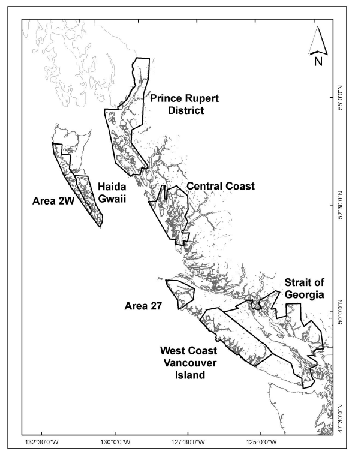
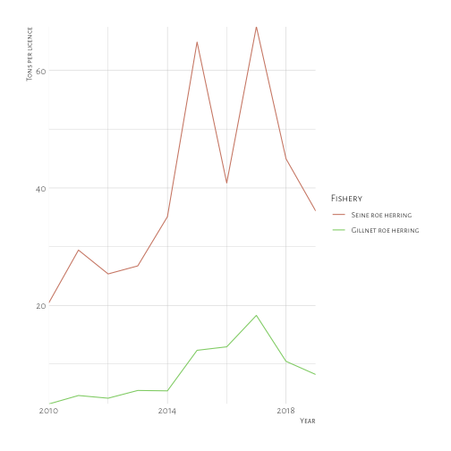

Prepared for Pacific Wild  


# Executive Summary

The Pacific herring roe fishery is a longstanding fishery in BC, and its epicenter is now the Strait of Georgia. Here, we investigate the economic value of the fishery within the context of other fisheries in the region and its history. In general, landings, overall value, and prices have declined for the sector over the past 20 years. This is a challenge to the BC seafood industry as the herring fishery has a strategic importance to the fisheries and seafood processing sector of generating work in the off-season, and the decrease in catches also leads to decreases in employment in the processing and export sectors. Those invested in the fishery have seen the decline in value as the licences and lease costs have decreased substantially along with the decline in value of the herring. Finally, we investigate the costs of closing the fishery for the 2019 season as a proposed means of recovery of the herring stocks and protection of species that rely upon them. 

## Terms & Notes
Ex-vessel value - the value of fish or seafood at its first point of sale (i.e., the price the fishers receive)
Unless otherwise stated, all values are expressed in real 2015 dollars to account for inflation over the time period studied. 
Tonnes refers to metric tonnes (1000 kilograms, 1kg = 2.2 lbs). Some reports use short tons (2000 lbs) and this was converted to metric tonnes when necessary. 

# Introduction

This report was prepared for Pacific Wild to evaluate the current value of the herring roe fishery in the Strait of Georgia. The herring roe fishery has a long history in British Columbia and is a valuable part of BC's seafood exports. This fishery makes up the largest component of the Pacific herring fisheries in BC, and is the most valuable aspect of the fishery. The herring fishery in BC is composed of several segments: roe herring undertaken with purse seines and gillnets, food and bait herring, herring spawn on kelp, and special use herring. Each of these has their own (or several) licences within the category that allow fishers to fish for this purpose. This report focuses specifically on the seine and gillnet roe fishery, while including the food and bait fishery and spawn on kelp fisheries when important for context. We also focus on one key fishing ground for the roe fishery, the Strait of Georgia (Figure \@ref(fig:map)), where the fishery has been especially concentrated in recent years. 



# The Fisheries
The Pacific herring fishery was formerly the largest fishery in BC until the fishery collapsed in the 1960s. Until that point, most of the fishery was used for the production of fishmeal and fish oil to support agriculture and livestock. The fishery was re-started in the 1970s with smaller catches destined for a high-value export of roe to the Japanese market. This fishery has proceeded to today being the main component of the herring fishery in BC (Figure \@ref(fig:catch-by-type)), with other fisheries being of much less importance by catch and value. The exception to this is the spawn on kelp fishery which is fished both commercial and as a Food, Social, and Ceremonial fishery by First Nations in BC. The other major component of the herring fishery in BC is the food and bait fishery. There are several other smaller special herring fisheries that are much smaller in tonnage and value than the three aforementioned components. Here we focus on the economically most important fishery: the herring roe fishery (Figure \@ref(fig:roe-fishery-sog)). 


```
## Error in loadNamespace(name): there is no package called 'webshot'
```


For the 2019 season, the expected catches across all herring fisheries is ~30,000 tonnes (Figure \@ref(fig:bar-chart-area-use)). The gillnet and seine roe fisheries are going to occur solely within the Strait of Georgia. Outside the Strait of Georgia, there are small fisheries as part of First Nations and commercial spawn on kelp fisheries (SOK), as well as Food, Social, and Ceremonial (FSC) fisheries. Other special use herring fisheries include human food and bait, sport fishing bait, personal use and fish for zoos and aquaria totalling ~800 tonnes. Grouping these together, the only commercial fishing outside the Strait of Georgia is for commercial spawn on kelp herring fisheries. 


```
## Error in loadNamespace(name): there is no package called 'webshot'
```


```
## Error in loadNamespace(name): there is no package called 'webshot'
```


# The Products
The main product of the roe fishery is the herring roe. This is exported in both frozen and cured forms to Japan. In general, the decline in ex-vessel prices for herring in BC are attributed to a decline in demand from the Japanese market. This has been attributed to a weakened Japanese economy and a change in tastes from older to younger generations. There is a growing share of herring products exported outside of Japan, mainly to China and the USA [@DFO2018]. 


While the roe is the backbone of the fishery, the majority by weight is the by-product of herring carcasses used for fishmeal and fish oil. There is limited information on the value of the carcasses, but one processor contacted during this study said that they are not paid for the carcasses, but they are picked up by the reduction company for no cost. By all accounts the carcasses from the roe herring fishery are used to produce fishmeal and fish oil in BC.  This fishmeal and fish oil are used primarily for salmon feed production that is fed to BC farmed salmon [@McGrath2015a]. Using industry average information, we can estimate the amount of fishmeal produced on average from the roe herring fishery, and the amount likely required by the BC farmed salmon industry. 

The carcass weight that is used for fishmeal is between 84% and 89% of the landed weight [@McGrath2015a; Anonymous Pers. Comm.]. The feed conversion ratio (the ratio of feed used per output of salmon) for farmed salmon in BC was 1.313 in 2009 [@Pelletier2009]. The average annual amount of farmed Atlantic salmon produced in BC was 81,467 tonnes from 2014 to 2016 [@AgriServiceBC2017]. A standard BC salmon feed contains 5% herring by-product meal and 2% herring by-product oil [@McGrath2015a]. Thus, we can estimate the herring fishmeal required to be 4,481 tonnes. Alternatively, we can estimate the amount of herring fishmeal and fish oil produced from the roe fishery by-products (averaged for 2014 and 2015) as 2,452 and 645 tonnes, respectively. Based on current export prices for herring meal and herring oil from Canada [@FAO2016a], the value of these combined products is estimated to be 8.6 million CAD. 


# The Supply Chain
Here, we measure employment in full-time equivalents (FTEs) to standardize the importance of these various industries that are seasonal by nature. A standard measure of full-time equivalent is 2080 hours annual, defined as 40 hours per week for 52 weeks per year. 

The combined fisheries for herring roe and food and bait generated 790 jobs during the season equivalent to 91 full-time equivalents [@SeafoodProducersAssociationofBC2015a]. The processing of herring generates more jobs, hours of work and total income for those involved than the capture portion of the fishery. There are additional jobs generated through spin-off employment including transportation, unloading of herring, and marketing and sales, although these are a much smaller portion when compared to fishing and processing. 


```
## Error in loadNamespace(name): there is no package called 'webshot'
```


```
## Error in loadNamespace(name): there is no package called 'webshot'
```


<table>
<caption>Fishery expenses, wages, and jobs for the herring supply chain</caption>
 <thead>
  <tr>
   <th style="text-align:left;"> Category </th>
   <th style="text-align:right;"> Roe expenses ($000s) </th>
   <th style="text-align:right;"> Food and Bait expenses ($000s) </th>
   <th style="text-align:right;"> Total expenses ($000s) </th>
   <th style="text-align:right;"> $000 Wages </th>
   <th style="text-align:left;"> FTEs </th>
   <th style="text-align:left;"> Jobs </th>
  </tr>
 </thead>
<tbody>
  <tr>
   <td style="text-align:left;"> Fishing </td>
   <td style="text-align:right;"> 10000 </td>
   <td style="text-align:right;"> 1575 </td>
   <td style="text-align:right;"> 11575 </td>
   <td style="text-align:right;"> 3636 </td>
   <td style="text-align:left;"> 91 </td>
   <td style="text-align:left;"> 790 </td>
  </tr>
  <tr>
   <td style="text-align:left;"> EI/WCB on Fish Purchases </td>
   <td style="text-align:right;"> 240 </td>
   <td style="text-align:right;"> 63 </td>
   <td style="text-align:right;"> 303 </td>
   <td style="text-align:right;"> 303 </td>
   <td style="text-align:left;"> - </td>
   <td style="text-align:left;"> - </td>
  </tr>
  <tr>
   <td style="text-align:left;"> Unloading </td>
   <td style="text-align:right;"> 960 </td>
   <td style="text-align:right;"> 378 </td>
   <td style="text-align:right;"> 1338 </td>
   <td style="text-align:right;"> 937 </td>
   <td style="text-align:left;"> 31 </td>
   <td style="text-align:left;"> 155 </td>
  </tr>
  <tr>
   <td style="text-align:left;"> Trucking </td>
   <td style="text-align:right;"> 560 </td>
   <td style="text-align:right;"> 252 </td>
   <td style="text-align:right;"> 812 </td>
   <td style="text-align:right;"> 203 </td>
   <td style="text-align:left;"> 5 </td>
   <td style="text-align:left;"> 25 </td>
  </tr>
  <tr>
   <td style="text-align:left;"> Processing </td>
   <td style="text-align:right;"> 19040 </td>
   <td style="text-align:right;"> 2520 </td>
   <td style="text-align:right;"> 21560 </td>
   <td style="text-align:right;"> 8856 </td>
   <td style="text-align:left;"> 221 </td>
   <td style="text-align:left;"> 885 </td>
  </tr>
  <tr>
   <td style="text-align:left;"> Marketing &amp; Sales </td>
   <td style="text-align:right;"> 960 </td>
   <td style="text-align:right;"> 157 </td>
   <td style="text-align:right;"> 1117 </td>
   <td style="text-align:right;"> 670 </td>
   <td style="text-align:left;"> 8 </td>
   <td style="text-align:left;"> 40 </td>
  </tr>
  <tr>
   <td style="text-align:left;"> Total </td>
   <td style="text-align:right;"> 32000 </td>
   <td style="text-align:right;"> 5355 </td>
   <td style="text-align:right;"> 37355 </td>
   <td style="text-align:right;"> 14605 </td>
   <td style="text-align:left;"> 356 </td>
   <td style="text-align:left;"> 1895 </td>
  </tr>
</tbody>
<tfoot>
<tr>
<td style = 'padding: 0; border:0;' colspan='100%'><sup>a</sup> Source: Exhibit 3. GSGislason &amp; Associates Ltd. Importance of Herring to BC Seafood Industry</td>
</tr>
</tfoot>
<tfoot>
<tr>
<td style = 'padding: 0; border:0;' colspan='100%'><sup>a</sup> Values for 2015. 16000 tonnes of Roe herring and 6300 tons of Food and bait herring</td>
</tr>
</tfoot>
</table>

```
## Help on topic 'kable' was found in the following packages:
## 
##   Package               Library
##   kableExtra            /Users/Tim/Library/R/3.4/library
##   knitr                 /Users/Tim/Library/R/3.4/library
## 
## 
## Using the first match ...
```


# Value of the Fisheries

To participate in the herring roe fishery, you need an active licence from DFO. At the beginning of the season, you must declare the area where you would like to fish that licence and the quota is distributed amongst the licences that are fishing in that area. The herring roe fishery is undertaken with gillnet (aka drift nets) and purse seines. These are licenced separately. 


```
## Error in loadNamespace(name): there is no package called 'webshot'
```


```
## Error in loadNamespace(name): there is no package called 'webshot'
```


The herring fishery is divided into five major stock areas. In the 1980s and 1990s the catch was more evenly distributed amongst these areas but the catch became concentrated in the Strait of Georgia over time, and now the most important area for the roe herring fishery is the Strait (Figure \@ref(fig:catches-area)). For the upcoming herring season (March-April 2019), there are no catches in the roe herring fisheries expected outside of the Strait of Georgia [@DFO2018]. The catches for the gillnet roe fishery have risen sharply in the past few years while the seine roe fishery landings have declined. The total quota assigned has fluctuated but the proportion used by the gillnet fishery has risen in recent years. This is partially attributed to an increasing number of seine roe licences being used to fish in the food and bait fishery instead of the roe fishery. The initial allocation of herring roe catches by gear type is a 55:45 split for the seine roe fishery [@DFO2018]. 


```
## Error in loadNamespace(name): there is no package called 'webshot'
```





```
## Error in loadNamespace(name): there is no package called 'webshot'
```


Over the past 10 years, the roe herring fishery has fluctuated between an ex-vessel value of 4 and 17 million (Figure \@ref(fig:landed-value)). Formerly the values were much higher exceeding 100 million CAD in 1987. In addition, the wholesale value is substantially higher than the landed value as herring roe is a value-added product. 


```
## Error in loadNamespace(name): there is no package called 'webshot'
```


As herring roe is a processed product, it naturally has a higher price than the raw material of whole herring. In addition, the wholesale value includes the value of the fishery derived from the processing of roe and production of fishmeal and fish oil from the herring by-products. 


```
## Error in loadNamespace(name): there is no package called 'webshot'
```

The decline in total value of the fishery is both a function of a decline in landings, and a decline in ex-vessel prices received by fishers. There is some indication, however, that the prices reported by fishers does not necessarily indicate lower profitability as processors have been more willing to pay fishers' fees (e.g., licence costs and Dockside Monitoring Program costs) thus lowering their cost of fishing [@SeafoodProducersAssociationofBC2015a]. Thus, the ex-vessel price decreases may be partially or wholly offset by the increased costs covered by processors. 


```
## Error in loadNamespace(name): there is no package called 'webshot'
```

There are differences in the price within the roe fishery itself. The seine fishery generally fetches a lower value than the gillnet fishery as the gillnet is more selective towards larger and older individuals which thus have a higher proportion of roe. This was confirmed by an industry expert, who estimates that 11-13% of the seine catch by weight is roe while the gillnet fishery is 14-16% roe by weight. In some years, this has led to price differences on the order of 3-4 times greater for gillnet than seine catches. While there are differences in the relative price of gillnet caught herring versus seine caught herring, they both follow the general trend of a large decline in ex-vessel prices over the past 25 years. 


```
## Error in loadNamespace(name): there is no package called 'webshot'
```


```
## Error in loadNamespace(name): there is no package called 'webshot'
```

# Ownership and Licenses
The roe herring fishery is managed by a limited entry licence program. The total allowable catch (TAC) is set at the beginning of the season based on DFO stock assessments. Before the season the licences must be pooled into self-selected groups for ease of management where the gillnet pools must have a  minimum of 4 licences per pool, and the seine fishery must have eight licences per pool but no more than 10 pools permitted in the Strait of Georgia [@DFO2018]. The TAC is then divided based on the number of licences in each pool. A seine roe licence can elect to fish instead in the Food and Bait fishery and then the amount of catch they would have caught in the roe fishery is switched to allow them to fish in the Food and Bait fishery. 

While the number of roe herring seine licenses is relatively constant, this does not have a strong relationship to the number of vessels actually fishing. Most vessels that fish have two licenses stacked on their vessel.
In 2007, only 38 seine vessels registered landings, while the total fleet of 133 vessels owned 248 licenses  [@Nelson2009]. The number of active fishing vessels in the seine fishery increased to 43 active vessels in 2009 [@Nelson2011].


```
## Error in loadNamespace(name): there is no package called 'webshot'
```


The trend in licences by area should be interpreted with caution as the field is blank for many of the entries in the commercial licence database. However, there does appear to be movement of licences to the remaining fishing areas as would be expected as some of the main fishing areas have been closed for several years (Figure \@ref(fig:licence-area)). This trend is apparent for the Strait of Georgia as well since 2000 (Figure \@ref(fig:licence-sog)).


```
## Error in loadNamespace(name): there is no package called 'webshot'
```


```
## Error in loadNamespace(name): there is no package called 'webshot'
```


<table>
<caption>Top 10 companies by herring roe licence ownership (seine and gillnet combined)</caption>
 <thead>
  <tr>
   <th style="text-align:left;"> Company </th>
   <th style="text-align:right;"> 2018 Herring roe licences </th>
  </tr>
 </thead>
<tbody>
  <tr>
   <td style="text-align:left;"> Jim Pattison Group </td>
   <td style="text-align:right;"> 228 </td>
  </tr>
  <tr>
   <td style="text-align:left;"> Aero Trading Co. Ltd. </td>
   <td style="text-align:right;"> 34 </td>
  </tr>
  <tr>
   <td style="text-align:left;"> Arctic Pearl Ice And Cold Storage Ltd. </td>
   <td style="text-align:right;"> 28 </td>
  </tr>
  <tr>
   <td style="text-align:left;"> Robert Recalma </td>
   <td style="text-align:right;"> 28 </td>
  </tr>
  <tr>
   <td style="text-align:left;"> A-Tlegay Fisheries Society </td>
   <td style="text-align:right;"> 25 </td>
  </tr>
  <tr>
   <td style="text-align:left;"> James Walkus </td>
   <td style="text-align:right;"> 25 </td>
  </tr>
  <tr>
   <td style="text-align:left;"> Salish Seas Fisheries Association </td>
   <td style="text-align:right;"> 24 </td>
  </tr>
  <tr>
   <td style="text-align:left;"> Randy Reifel </td>
   <td style="text-align:right;"> 23 </td>
  </tr>
  <tr>
   <td style="text-align:left;"> Gwabalis Fisheries Society </td>
   <td style="text-align:right;"> 18 </td>
  </tr>
  <tr>
   <td style="text-align:left;"> Corrine Rockl </td>
   <td style="text-align:right;"> 16 </td>
  </tr>
  <tr>
   <td style="text-align:left;"> Other </td>
   <td style="text-align:right;"> 1026 </td>
  </tr>
</tbody>
</table>

The largest owner(s) of herring roe licences are the companies belonging to the Jim Pattison Group (Table \@ref(tab:licence-table)). This concentration in this firm has grown over time and now represents 15% of total roe licences. Of these, the Pattison group is more heavily invested in the seine licences which are worth more and account for more landings in the roe fisheries (Figure \@ref(fig:licence-pattison)). Therefore, the Pattison Group's expected quota for 2019 in the Strait of Georgia is 3,823 out of the total 19,498 metric tonnes (19.6%).  Outside of those owned by the Jim Pattison Group, there is significant concentration in the top 10 largest herring licence holders. 


```
## Error in loadNamespace(name): there is no package called 'webshot'
```


A standard measure of inequality is the Gini index. The Gini index is a value between 0 and 1, where 1 represents perfect inequality and 0 represents perfect equality. This measure has been applied to fishing licences and fleets to measure equity. It was applied to the BC salmon and herring fisheries and found a large share of corporate control [@Haas2016]. As corporate control has become a concern for BC, here we investigate the change in inequality in the fishery over time. There has been a significant increase in the inequality of the herring licence division over time occurring in both the seine and gillnet roe fisheries (Figure \@ref(fig:gini-time)). 


```
## Error in loadNamespace(name): there is no package called 'webshot'
```


The value of roe herring licences for both the gillnet and seine have declined substantially since high levels in the late 1990s and early 2000s. The outright licence fees are so much lower that the lease value of these licences has dropped to near zero. By industry accounts, there is very little leasing of licences in the gillnet fishery and almost none in the seine fishery. 


```
## Error in loadNamespace(name): there is no package called 'webshot'
```


# How does the roe herring fishery stack up?
Based on data from BC statistics [@AgriServiceBC2018], wild salmon processing generates ~4x as much in wages as herring processing does. In 2016 when wild salmon and herring catches were comparable (24,700 tonnes and 24,100 tonnes, respectively), wild salmon generated 5.4x as many processing jobs (annual average of 1,400 compared to 332 for herring) [@AgriServiceBC2018]. Similarly, these jobs resulted in higher wages for wild salmon that generated just over \$2,000/tonne processed while herring was \$525/tonne. 


```
## Error in loadNamespace(name): there is no package called 'webshot'
```


Compared to other valuable species in the Strait of Georgia, such as salmon, herring catches are higher in tonnage but lower in value. 


```
## Error in loadNamespace(name): there is no package called 'webshot'
```


```
## Error in loadNamespace(name): there is no package called 'webshot'
```

In addition to the commercial fishery in the Strait of Georgia, there is a valuable recreational fishery for salmon in the Strait of Georgia. While other areas of the BC coast account for larger numbers of salmon caught by recreational fishers, the Strait of Georgia has the most fishing effort recorded in boat days for those areas with data (Note: Northern and Central coast data was not available for this year). One crude measure of the value of the recreational fisheries is the value they produce in fish themselves if the fish was sold commercially [@Colquhoun2015]. This measure of value is crude and non-inclusive as recreational fishing is not solely for the production of fish, and countless studies have shown that the value recreational fishing gives to society far exceeds this 'product' value. Nevertheless, the product value of recreational tidal water salmon fisheries in BC is over 15 million dollars annually, with the Strait of Georgia accounting for 1.3 million dollars of this.   


```
## Error in loadNamespace(name): there is no package called 'webshot'
```


```
## Error in loadNamespace(name): there is no package called 'webshot'
```


```
## Error in loadNamespace(name): there is no package called 'webshot'
```

# Going forward: A look into closing the roe herring fishery


Pacific Wild asked the author to consider a temporary closure of the fishery with the aim of protecting the ecosystem as herring plays an important role in many of its predators' diets. This closure has been proposed to rebuild herring stocks and protect the species that rely upon herring in this ecosystem. The following details options based on previous experience of temporary fishery closures and licence buy-backs in Canada. 

The first example will draw directly from the BC herring fishery. In recent years, the roe herring fishery has had quota assigned to fishing areas where a fishery opening did not occur [@GovernmentofCanada2014]. Many fishers had purchases licences for these areas prior to the fishery opening and were not allowed to fish them. In these cases, the fishers were reimbursed for the cost of the licence [@GovernmentofCanada2014], but not for any extra costs or the lost income of the fishery. In this case, the cost of reimbursement for the licences for the 2019 season is expected to be a maximum of 1,256,360 (assuming that all licences are full fee, which gives a maximum value rather than the true value).

For a temporary closure, the government could act in ways that is has in the past when extenuating circumstances warrant a closure of a fishery. In this case, the compensation that fishers receive is closely in line with what fishers receive for employment insurance payments [@Emery1992a; @CBCNews2007]. These payments take into account the regional rate of unemployment, earnings from fishing, earnings from other activities, and a predetermined allowed maximum weekly amount [@GovernmentofCanada2019]. The maximum weekly amount in 2019 is \$1,021 a week [@GovernmentofCanada2019]. If a fisher's total weekly earnings was less than this, they would use that amount in its place. The amount paid is 55% of the lower of the two numbers, thus making the maximum amount paid per fisher \$562. As we determined the full-time equivalent contribution of the roe herring fishers in the Strait of Georgia and the processing jobs they generate, we can use these FTEs and the maximum weekly amount paid to compensate for the loss of this fishery to fishers and processors as has been done with other fishery closures [@Emery1992a]. Therefore, the cost of income supplements for a temporary closure of the fishery is estimated to be \$175,344. 

Licenses are retired in fisheries to reduce capacity to a more ecologically or economically sustainable level, or to permanently close the fishery. The roe herring fishery is a limited entry licence fishery similar to the Pacific salmon fisheries in BC. Therefore, we can use the salmon fishery licence buybacks as an option for this fishery if there are believed to be benefits from reducing capacity. From 1996 to 2000, 1,406 salmon licences (34% of licenses in 1996) were retired at a total cost of \$195 million dollars (~\$138,000 per licence). As the roe herring licences are at a near all-time low cost, it would likely be less expensive to remove these licenses and there are less licenses to begin with in the fishery (total roe herring licenses of 1,475). In addition, the average seine herring license is valued at approximately \$50,000 and the average gillnet herring licence is valued at \$25,000. Therefore, the cost of retiring these licenses would likely be less than it was for salmon. The effectiveness of a licene retirement program is predicated on the limiting of expansion of effort in the remaining fleet. Therefore, a licence retirment program would not be successful without additional caps on fishing capacity and effort. 

These strategies may not fully consider the potential strategic importance of the fishery. The herring fishery may be of particular strategic importance as it is a fishing and processing activity that occurs at an off-peak time of year for the fishing industry, and keeps income flowing to keep people employed closer to year-round. This may be especially important for the administrative side of the industry and provides additional weeks of employment to fishers and processors [@SeafoodProducersAssociationofBC2015a]. Without these additional weeks, the increased precariousness of employment could lead to higher turnover of staff. 

# Conclusion

The roe herring fishery's catches declined substantially over the 2000s, but have begun to increase again since 2011. However, the value the fishery has not responded in the same way due to decreasing prices paid to the fishers (ex-vessel value), and the decline in value of the main product of the fishery: herring roe. The fishery is now concentrated solely in the Strait of Georgia. 


# References
